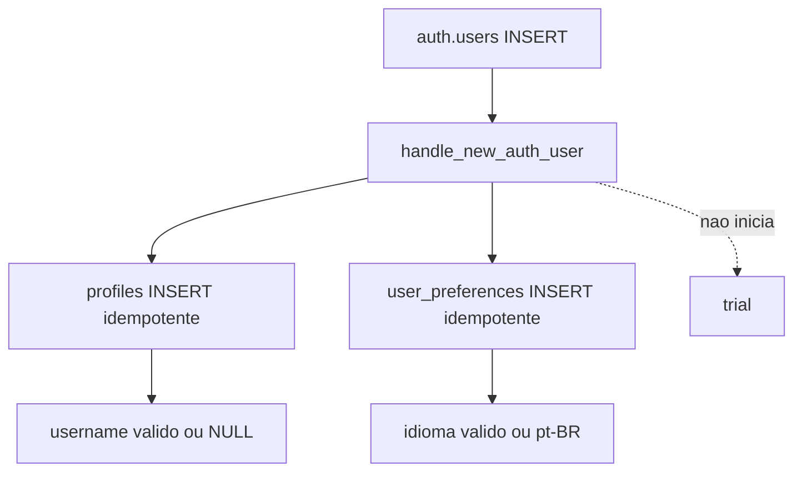
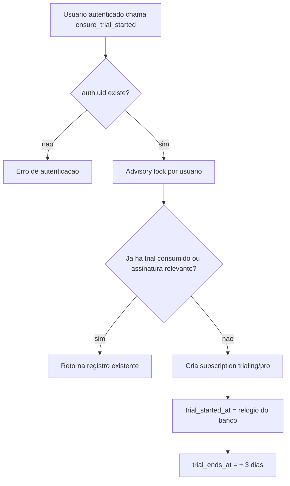
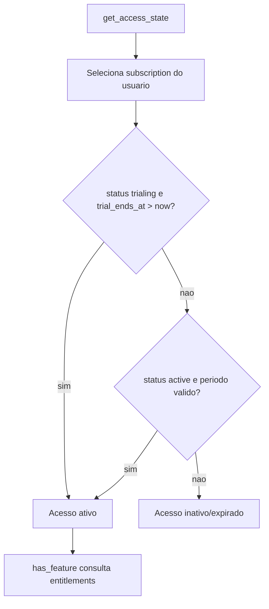

# Fase 3 - Revisao da Fundacao do Banco

## Escopo

Esta fase cria a fundacao inicial do banco Supabase para identidade, preferencias, catalogo de planos, entitlements, assinatura, trial de 3 dias, controle inicial de acesso, bootstrap de usuario, RLS, grants e testes SQL.

Nada foi aplicado ao projeto remoto. As migrations foram apenas criadas localmente para revisao.

Fora do escopo desta fase:

- autenticacao no frontend;
- provas, conteudos, cronogramas, tarefas e sessoes de estudo;
- Pomodoro, flashcards, anexos, social e notificacoes;
- pagamentos reais, checkout, webhooks e IA.

## Migrations

Ordem planejada:

1. `20260713000100_create_foundation_extensions_and_types.sql`
2. `20260713000200_create_profiles_and_preferences.sql`
3. `20260713000300_create_subscription_catalog.sql`
4. `20260713000400_create_subscriptions.sql`
5. `20260713000500_create_user_bootstrap.sql`
6. `20260713000600_create_trial_and_access_functions.sql`
7. `20260713000700_enable_rls_and_policies.sql`
8. `20260713000800_seed_subscription_catalog.sql`

As migrations sao separadas por dependencia: extensoes e tipos, tabelas de usuario, catalogo, assinaturas, bootstrap, funcoes de acesso, RLS/grants e seed.

## Tabelas

### `public.profiles`

Perfil privado do usuario.

Colunas:

- `id uuid`: PK e FK para `auth.users(id)` com cascade.
- `full_name text`: nome opcional, validado por tamanho e caracteres de controle.
- `username citext`: opcional ate onboarding, unico quando presente.
- `avatar_path text`: path de Storage, nao URL publica obrigatoria.
- `onboarding_completed boolean`: default `false`.
- `created_at timestamptz`.
- `updated_at timestamptz`.

Username permitido:

- 3 a 30 caracteres;
- letras minusculas;
- numeros;
- underscore;
- sem espacos;
- sem ponto nesta fase.

Decisao: `username` pode ser `NULL` ate onboarding. Isso evita que cadastro falhe por metadata invalida ou username duplicado informado no signup.

### `public.user_preferences`

Uma linha por usuario, sincronizada entre dispositivos.

Colunas:

- `user_id uuid`: PK e FK para `profiles(id)`.
- `language_code text`: `pt-BR`, `es` ou `en`.
- `theme_mode text`: `light`, `dark` ou `system`.
- `theme_preset text`: preset semantico inicial.
- `timezone text`: default `UTC`, esperado como IANA quando possivel.
- `week_starts_on smallint`: 0 domingo a 6 sabado.
- `date_format text`.
- `time_format text`.
- `created_at timestamptz`.
- `updated_at timestamptz`.

Editor avancado de paleta personalizada permanece fora desta fase.

### `public.subscription_plans`

Catalogo de planos internos.

Colunas:

- `code text`: PK estavel.
- `display_name text`.
- `description text`.
- `is_active boolean`.
- `is_public boolean`.
- `sort_order integer`.
- `metadata jsonb`.
- `created_at timestamptz`.
- `updated_at timestamptz`.

Nao ha preco, checkout ou provedor de pagamento nesta tabela.

### `public.plan_entitlements`

Catalogo central de capacidades por plano.

Colunas:

- `id uuid`.
- `plan_code text`: FK para `subscription_plans(code)`.
- `feature_code text`.
- `enabled boolean`.
- `limit_value jsonb`.
- `created_at timestamptz`.
- `updated_at timestamptz`.

`limit_value` aceita limites futuros sem pressupor apenas numeros. Quando possivel, preferir objeto JSON nomeado, por exemplo `{"max_active_exams": 3}`.

### `public.subscriptions`

Registros auditaveis de trial e assinatura.

Colunas:

- `id uuid`.
- `user_id uuid`: FK para `profiles(id)`.
- `plan_code text`: FK para `subscription_plans(code)`.
- `status app_subscription_status`.
- `trial_started_at timestamptz`.
- `trial_ends_at timestamptz`.
- `trial_consumed_at timestamptz`.
- `current_period_started_at timestamptz`.
- `current_period_ends_at timestamptz`.
- `cancel_at_period_end boolean`.
- `canceled_at timestamptz`.
- `provider text`.
- `provider_customer_id text`.
- `provider_subscription_id text`.
- `created_at timestamptz`.
- `updated_at timestamptz`.

Estrategia de historico escolhida: multiplas subscriptions por usuario, com indice unico parcial para apenas uma assinatura corrente. Essa escolha preserva auditabilidade, facilita webhooks futuros e evita reescrever o modelo quando houver provedores reais.

`trial_consumed_at` registra o consumo do beneficio unico e impede reinicio por mudanca de status ou nova chamada da RPC.

## Tipos

Tipo criado:

- `public.app_subscription_status`: `trialing`, `active`, `past_due`, `canceled`, `expired`, `paused`, `incomplete`.

Planos nao sao enum. Eles sao registros de catalogo para permitir evolucao comercial.

## Funcoes

### `public.set_updated_at()`

Funcao reutilizavel para atualizar `updated_at` em updates.

### `public.normalize_username(text)`

Normaliza usernames para lowercase e trim usando `citext`.

### `public.normalize_profile_fields()`

Normaliza `full_name`, `username` e `avatar_path` antes de inserir ou atualizar `profiles`.

### `public.handle_new_auth_user()`

Trigger function `SECURITY DEFINER` executada apos insert em `auth.users`.

Cria:

- `public.profiles`;
- `public.user_preferences`.

Nao inicia trial. Metadata invalida ou username duplicado cai para `NULL`, preservando o cadastro e deixando o onboarding resolver depois.

### `public.ensure_trial_started()`

RPC autenticada, idempotente e segura.

Regras:

- usa `auth.uid()`;
- rejeita chamada sem autenticacao;
- nao aceita `user_id`, `plan_code`, datas ou status do cliente;
- usa `statement_timestamp()` como relogio do banco;
- cria trial apenas uma vez;
- usa plano `pro`;
- define `trial_ends_at = trial_started_at + interval '3 days'`;
- usa advisory lock por usuario para reduzir risco de concorrencia;
- retorna somente dados necessarios.

### `public.get_access_state()`

Calcula estado de acesso sem confiar somente no campo `status`.

Mesmo que uma assinatura continue com `status = trialing`, se `trial_ends_at <= now()`, o acesso e tratado como expirado.

### `public.has_active_access()`

Retorna booleano para acesso ativo.

### `public.has_feature(text)`

Valida o formato do `feature_code`, consulta o estado de acesso e verifica entitlement habilitado no plano ativo.

## Triggers

- `normalize_profile_fields` em `profiles`.
- `set_profiles_updated_at` em `profiles`.
- `set_user_preferences_updated_at` em `user_preferences`.
- `set_subscription_plans_updated_at` em `subscription_plans`.
- `set_plan_entitlements_updated_at` em `plan_entitlements`.
- `set_subscriptions_updated_at` em `subscriptions`.
- `on_auth_user_created_create_foundation_records` em `auth.users`.

## RLS e policies

RLS habilitada em todas as tabelas publicas criadas.

Policies:

- `profiles_select_own`: usuario le apenas o proprio perfil.
- `profiles_update_own`: usuario atualiza apenas o proprio perfil.
- `user_preferences_select_own`: usuario le apenas as proprias preferencias.
- `user_preferences_update_own`: usuario atualiza apenas as proprias preferencias.
- `subscription_plans_select_visible`: usuario autenticado le apenas planos ativos e publicos.
- `plan_entitlements_select_visible_plans`: usuario autenticado le entitlements de planos visiveis.
- `subscriptions_select_own`: usuario le apenas as proprias subscriptions.

Nao ha policies de insert/update/delete para `subscriptions` por cliente comum.

## Grants

Revokes:

- todas as tabelas criadas revogam privilegios de `PUBLIC`, `anon` e `authenticated` antes dos grants especificos;
- RPCs de acesso revogam `EXECUTE` de `PUBLIC` e `anon`.

Grants para `authenticated`:

- `profiles`: `select` e update apenas de `full_name`, `username`, `avatar_path`, `onboarding_completed`;
- `user_preferences`: `select` e update apenas dos campos de preferencia;
- `subscription_plans`: `select`;
- `plan_entitlements`: `select`;
- `subscriptions`: `select`;
- `ensure_trial_started`, `get_access_state`, `has_active_access`, `has_feature`: `execute`.

`anon` nao recebe acesso a dados privados.

## Indices

- `profiles_username_key`: unicidade case-insensitive de username nao nulo.
- `plan_entitlements_plan_code_idx`: consulta por plano.
- `plan_entitlements_feature_code_idx`: consulta por feature.
- `subscriptions_user_id_idx`: consultas da assinatura do usuario.
- `subscriptions_status_idx`: manutencao e consultas por status.
- `subscriptions_trial_ends_at_idx`: verificacao de expiracao.
- `subscriptions_one_current_per_user_idx`: uma assinatura corrente por usuario.
- `subscriptions_one_trial_consumed_per_user_idx`: um trial consumido por usuario.
- `subscriptions_provider_customer_id_key`: unicidade futura de customer externo.
- `subscriptions_provider_subscription_id_key`: unicidade futura de assinatura externa.

Indices redundantes com PKs e uniques foram evitados.

## Seeds

Seed idempotente em migration:

- `essential`: ativo e publico;
- `pro`: ativo e publico;
- `pro_ai`: inativo e oculto.

Entitlements iniciais:

- Essential: `schedule.daily`, `schedule.weekly`, `schedule.basic_rescheduling`, `flashcards.basic`, `analytics.basic`, `themes.presets`.
- Pro: tudo do Essential mais `schedule.monthly`, `schedule.timeline`, `schedule.advanced_rescheduling`, `flashcards.attachments`, `analytics.advanced`, `themes.custom`, `exports.enabled`.

Decisao: manter o seed do catalogo em migration, nao em `supabase/seed.sql`, porque as funcoes de trial/acesso dependem do plano `pro` existir em qualquer ambiente novo.

## Testes

Arquivo criado:

- `supabase/tests/foundation_test.sql`

Coberturas planejadas:

- bootstrap automatico de profile;
- bootstrap automatico de preferencias;
- isolamento de profile entre usuarios;
- isolamento de preferencias entre usuarios;
- bloqueio de insert/update direto em subscriptions;
- leitura apenas da propria subscription;
- trial unico e idempotente;
- segunda chamada nao altera datas;
- chamadas repetidas nao geram dois trials validos;
- trial de tres dias usando relogio do banco;
- trial concede plano `pro`;
- usuario nao escolhe plano do trial;
- acesso expira por data, mesmo com status ainda `trialing`;
- `has_feature` respeita plano;
- Pro contem recursos do Essential;
- `pro_ai` inativo;
- constraints rejeitam datas invalidas;
- username duplicado case-insensitive e rejeitado;
- anonimo nao acessa dados privados.

Os testes exigem Supabase local com pgTAP. Docker nao foi iniciado automaticamente.

## Fluxos

### Criacao de usuario

### Inicio do trial

### Verificacao de acesso

## Reversao antes de producao

Como nada foi aplicado ao remoto, a reversao antes de producao consiste em editar ou remover as migrations locais antes de qualquer `db push`.

Se as migrations forem aplicadas futuramente em ambiente local e precisarem ser desfeitas antes de producao, usar `supabase db reset` apenas em ambiente local descartavel. Nao executar reset ou push no remoto sem autorizacao explicita.

## Quando `db push` for executado futuramente

O banco recebera:

- extensoes `pgcrypto` e `citext`;
- tipo `app_subscription_status`;
- cinco tabelas publicas;
- funcoes e triggers;
- RLS/policies/grants;
- catalogo inicial de planos e entitlements.

Apos aplicacao autorizada, os tipos TypeScript devem ser gerados pela Supabase CLI. Nao gerar `database.types.ts` manualmente.

## Riscos

- Testes de concorrencia real precisam ser confirmados em Supabase local; o teste atual cobre idempotencia sequencial.
- `citext` precisa estar disponivel no ambiente Supabase; a migration cria a extensao de forma idempotente.
- `trial_consumed_at` impede reinicio por mudanca de status, mas uma exclusao fisica administrativa de linhas historicas removeria o historico. Clientes comuns nao possuem delete.
- `timezone` possui validacao estrutural simples; validacao contra lista IANA fica para camada de aplicacao ou funcao futura.
- Policies de catalogo permitem leitura apenas autenticada; leitura anonima pode ser revista quando existir pagina publica de precos.

## Decisoes adiadas

- Cron job de expiracao do trial.
- Webhooks e provedores de pagamento.
- Historico separado de eventos de assinatura.
- Storage de avatar.
- Paleta customizada em JSONB.
- Rate limit server-side para RPCs sensiveis.
- Tipos TypeScript gerados do banco.
